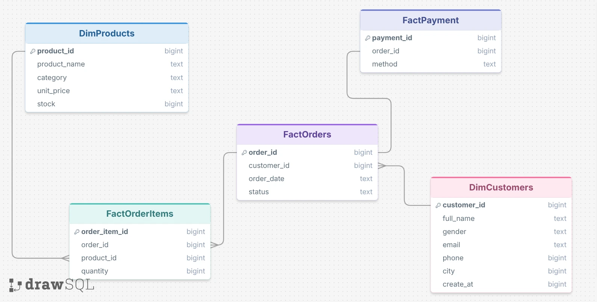
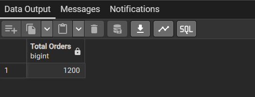
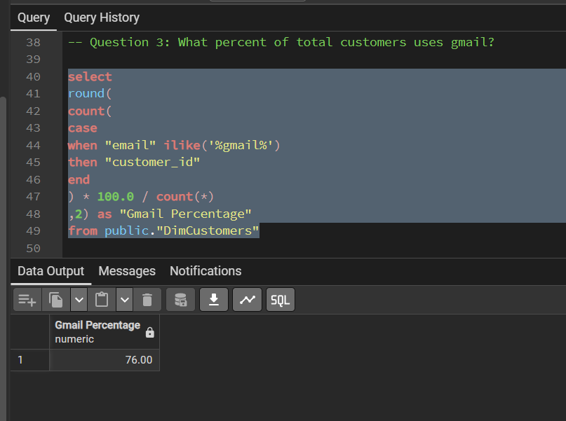
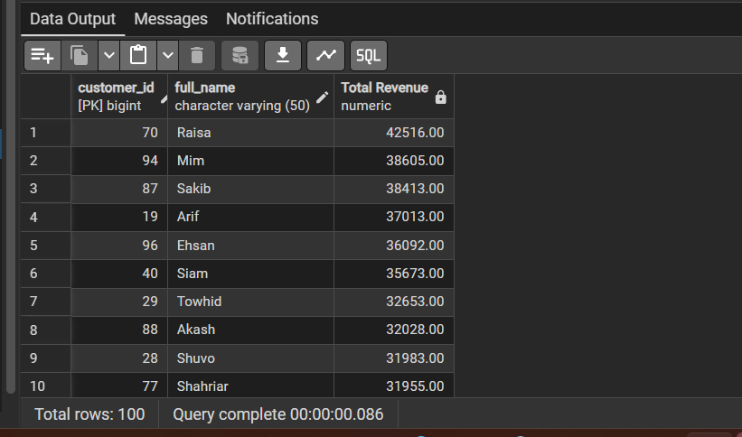
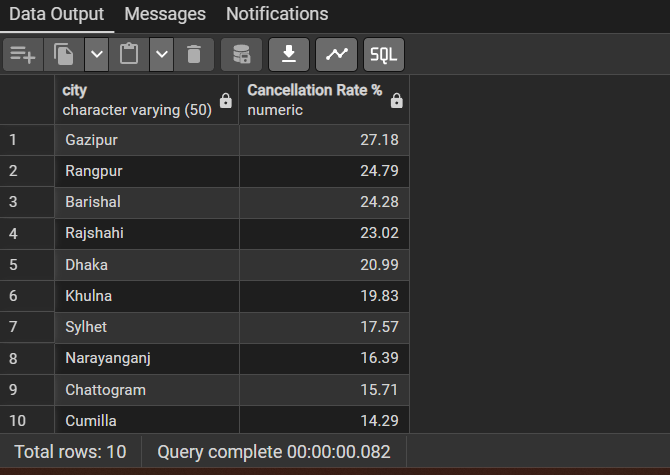
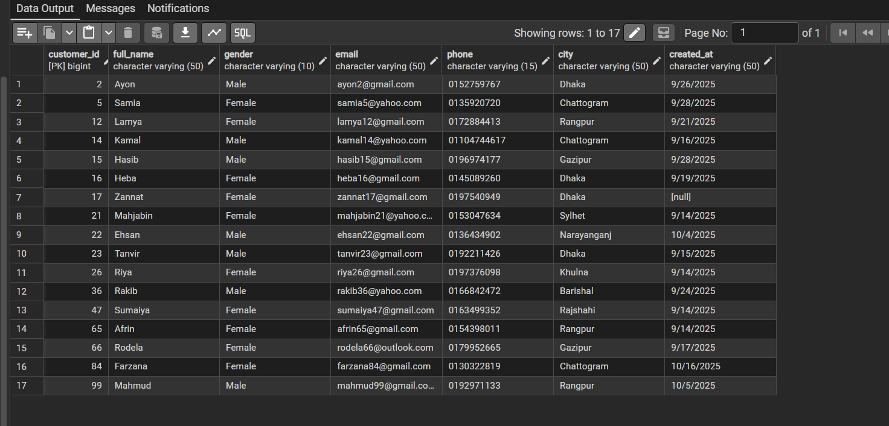
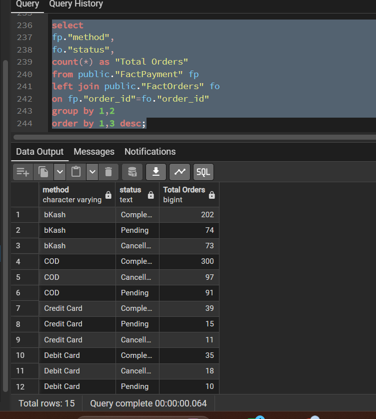
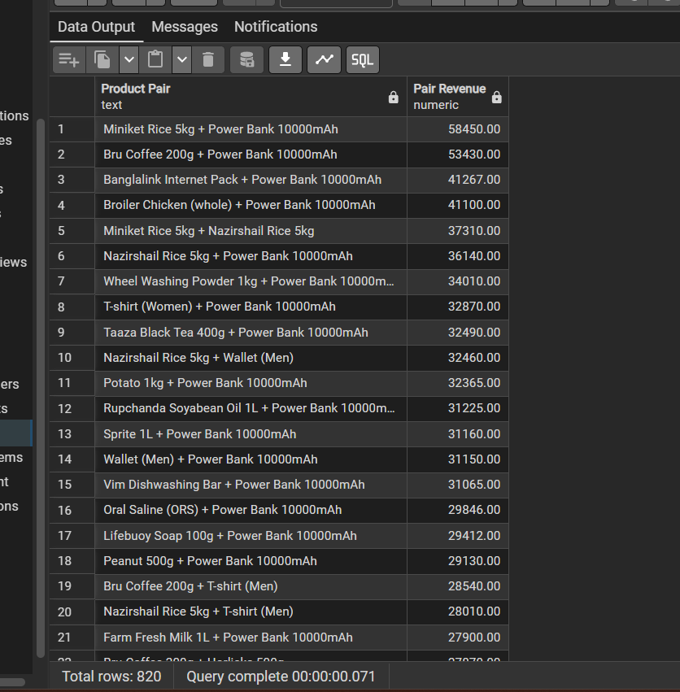

# UrbanCart Data Analytics

SQL-Based Business Analytics Project for UrbanCart E-Commerce Dataset

---

## Project Overview

UrbanCart is a growing e-commerce retail business operating across multiple cities. This project uses PostgreSQL to analyze transactional data and generate actionable business insights related to sales performance, customer behavior, inventory management, payment preferences, customer retention, and product affinity patterns.

The goal is to support data-driven decision-making through structured SQL analysis and business intelligence reporting.

---

## Project Objectives

This project aims to answer 25 business-oriented analytical questions covering:

* Sales Performance Analysis
* Customer Behavior Analysis
* Product Performance Analysis
* Inventory Monitoring
* Customer Retention Analysis
* Payment Method Analysis
* Product Affinity Analysis
* Business Reporting

---

## Project Snapshot

| Metric | Value |
|---------|---------|
| Total Customers | 100 |
| Total Products | 41 |
| Total Orders | 1,200 |
| Total Order Items | 4,621 |
| Total Units Ordered | 11,509 |
| Product Categories | 12 |
| Payment Methods | 5 |
| Order Date Range | September 2025 – December 2025 |

---

## Data Assets

| Dataset File | Description |
|--------------|-------------|
| DimCustomers | Customer demographic and contact information |
| FactOrders | Order records and status information |
| FactOrderItems | Product level transaction details |
| DimProducts | Product catalog, categories, pricing, and stock |
| FactPayment | Payment transaction information |


---

## Data Model Summary

| Table Name | Primary Key | Purpose |
|------------|------------|----------|
| DimCustomers | customer_id | Stores customer information |
| FactOrders | order_id | Stores order transactions |
| FactOrderItems | order_item_id | Stores product level sales |
| DimProducts | product_id | Stores product catalog information |
| FactPayment | payment_id | Stores payment details |

---

## Order Status Distribution

| Status | Business Meaning |
|----------|----------------|
| Completed | Successfully completed orders |
| Pending | Orders awaiting processing |
| Cancelled | Orders cancelled before completion |

---

## Payment Methods Available

| Payment Method |
|----------------|
| Cash on Delivery (COD) |
| bKash |
| Nagad |
| Credit Card |
| Debit Card |

---

## Product Categories

| Category |
|-----------|
| Beverages |
| Dairy |
| Digital |
| Electronics |
| Fashion |
| Grocery |
| Health |
| Home Care |
| Meat |
| Personal Care |
| Poultry |
| Snacks |

---

## Data Quality Notes

| Check | Status |
|---------|---------|
| Duplicate Customer IDs | Not Found |
| Duplicate Order IDs | Not Found |
| Missing Product IDs | Not Found |
| Missing Customer References | Not Found |
| Missing Payment Records | Not Found |
| Referential Integrity | Maintained |

---


## Data Validation Summary

| Validation Check                    | Status    |
| ----------------------------------- | --------- |
| Missing Value Assessment            | Completed |
| Duplicate Record Check              | Passed    |
| Primary Key Validation              | Passed    |
| Foreign Key Relationship Validation | Passed    |
| Data Type Consistency Check         | Passed    |

---

## Business Analytics Areas

| Analysis Area       | Focus                                         |
| ------------------- | --------------------------------------------- |
| Sales Analytics     | Revenue, orders, and sales trends             |
| Customer Analytics  | Customer behavior and retention               |
| Product Analytics   | Product performance and category contribution |
| Inventory Analytics | Stock monitoring and stock-out risks          |
| Payment Analytics   | Payment preference and transaction analysis   |
| Affinity Analytics  | Product bundling and association analysis     |
| Reporting           | Business performance monitoring               |

---

## Database Schema (ER Diagram)



---

## Visual Analytics

### Payment Method Distribution


**Insight:** Cash on Delivery (COD) accounts for the largest share of transactions, while bKash and Nagad collectively represent nearly half of all payment activity.

### Product Category Distribution


**Insight:** Fashion, Beverages, and Personal Care are the largest product categories in the catalog. The product portfolio is diversified across multiple categories, supporting broader customer demand and cross-selling opportunities.

---

## Business Questions Addressed

## Business Questions Addressed

1. Total Orders Received
2. Top Cities by Orders and Revenue
3. Gmail Customer Percentage
4. Monthly Order Trend
6. Total Revenue Generated
7. Revenue by Product Category
8. Top Revenue Generating Products
9. Average Order Value and Basket Size
10. Stock-out Risk Products
11. Top Revenue Contributing Customers
12. Cancellation Rate by City and Customer
13. Gender Based Purchasing Pattern
14. Customer Purchasing Behavior Over Time
15. Customers Ordered in October but not December
16. Customers Ordered in Both October and December
17. Most Used Payment Methods
18. Payment Method vs Order Status
19. City-wise Payment Preference
20. High Value Orders by Payment Method
21. Average Items per Order by Payment Method
22. Product Price vs Category Average Price
23. Frequently Purchased Product Pairs
24. Highest Revenue Product Pairs
25. Daily Business Performance Report


---

## SQL Scripts

All SQL queries used in this project are organized and stored in the `sql_queries/` directory.

The repository contains separate SQL files for each business question, making the analysis easier to review and maintain.

The SQL scripts cover:

- Sales Performance Analysis
- Customer Behavior Analysis
- Product Performance Analysis
- Inventory Monitoring
- Payment Method Analysis
- Customer Retention Analysis
- Product Affinity Analysis
- Business Reporting

---

## SQL Concepts Demonstrated

| SQL Concept | Usage |
|-------------|---------|
| SELECT Statements | Data Retrieval |
| WHERE Clause | Data Filtering |
| ORDER BY | Sorting Results |
| GROUP BY | Aggregation Analysis |
| Aggregate Functions | COUNT, SUM, AVG |
| INNER JOIN | Multi-table Analysis |
| LEFT JOIN | Data Completeness Checks |
| CASE Statements | Conditional Analysis |
| Subqueries | Advanced Filtering |
| Common Table Expressions (CTE) | Product Affinity Analysis |

---

## Sample Output Screenshots

### Q1. Total Orders



### Q2. Cities Generating Highest Revenue


### Gmail Customer Percentage 

 

### Monthly order Trend

 

### Q7. Product Category Revenue Analysis


### Q10. Stock-Out Risk Products


### Q11. Top Customers by Revenue



### Q12. Cancellation Rate by City 



### Q15. Customers Ordered In October but not December



### Q17. Payment Method Analysis


### Q18. Payment Method vs Order Status



### Q23. Product Affinity Analysis


### Q24. Highest Revenue Product Pairs 




### Q25. Daily Business Performance Report


---

## Key Findings and Insights

### Sales Performance

* UrbanCart processed a total of 1,200 orders during the analysis period.
* Revenue generation is concentrated within a small number of high-performing cities.
* A limited number of products contribute a substantial portion of overall revenue.

### Customer Insights

* Gmail is the dominant email provider among customers.
* High-value customers contribute significantly to total revenue.
* Seasonal purchasing patterns reveal customer retention opportunities.

### Product Insights

* Revenue contribution varies considerably across product categories.
* Several products exhibit stock-out risk due to strong demand and low inventory.
* Product affinity analysis identified frequently purchased product combinations.

### Payment Insights

* Customer payment preferences vary across locations.
* Certain payment methods dominate transaction volume.
* Payment behavior influences order completion and cancellation trends.

---

## Business Recommendations

| Business Area         | Recommendation                                                        |
| --------------------- | --------------------------------------------------------------------- |
| Revenue Growth        | Focus marketing investment on high-performing cities and products     |
| Customer Retention    | Launch loyalty programs and targeted re-engagement campaigns          |
| Inventory Management  | Monitor high-demand products and improve replenishment planning       |
| Product Bundling      | Create bundle offers based on product affinity analysis               |
| Payment Optimization  | Promote preferred payment methods and investigate cancellation trends |
| Business Intelligence | Develop KPI dashboards for continuous performance monitoring          |

---

## Technologies Used

* PostgreSQL
* SQL
* pgAdmin 4
* DrawSQL
* Microsoft Excel
* GitHub

---

## Repository Structure

```text
UrbanCart-Data-Analytics
│
├── README.md
├── ER_Diagram.png
├── database/
├── sql_queries/
└── outputs/

```

## Author

**Rubina Akter**

Department of Geography and Environment

SQL-Based Retail Business Analytics Project using PostgreSQL.


