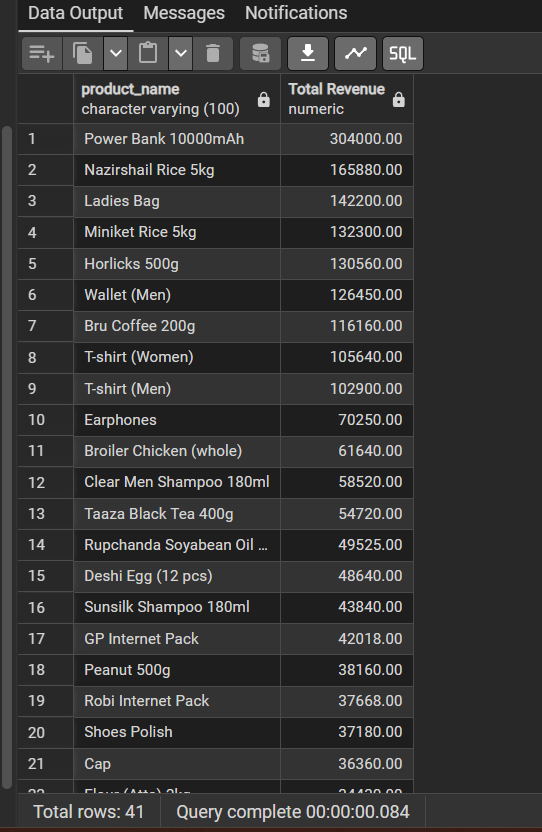

# UrbanCart Data Analytics

SQL-Based Business Analytics Project for UrbanCart E-Commerce Dataset

## Project Overview

UrbanCart is a growing online retail company operating across multiple cities. This project analyzes transactional business data using SQL to generate actionable business insights for sales growth, customer retention, inventory management, payment optimization, and product recommendations.

## Project Objectives

The objective of this project is to answer 25 business questions related to:

- Sales Performance Analysis
- Customer Behavior Analysis
- Product Performance Analysis
- Inventory Management
- Payment Method Analysis
- Customer Retention
- Product Affinity Analysis
- Business Reporting

## Database Schema (ER Diagram)


### Tables Used

#### DimCustomers
Stores customer information.

#### FactOrders
Stores order details and order status.

#### FactOrderItems
Stores products purchased in each order.

#### DimProducts
Stores product information, category, price, and stock.

#### FactPayment
Stores payment method information.

---

## Business Questions Addressed

1. Total Orders Received
2. Top Cities by Orders and Revenue
3. Gmail Customer Percentage
4. Monthly Order Trend
6. Total Revenue Generated
7. Revenue by Product Category
8. Top Revenue Generating Products
9. Average Order Value and Basket Size
10. Stock-out Risk Products
11. Top Revenue Contributing Customers
12. Cancellation Rate by City and Customer
13. Gender Based Purchasing Pattern
14. Customer Purchasing Behavior Over Time
15. Customers Ordered in October but not December
16. Customers Ordered in Both October and December
17. Most Used Payment Methods
18. Payment Method vs Order Status
19. City-wise Payment Preference
20. High Value Orders by Payment Method
21. Average Items per Order by Payment Method
22. Product Price vs Category Average Price
23. Frequently Purchased Product Pairs
24. Highest Revenue Product Pairs
25. Daily Business Performance Report

---


## Sample Output Screenshots

### Total Orders


### Cities Generating Highest Revenue


### Gmail Customer Percentage


### Monthly order Trend


### Product Category Revenue Analysis


### Top Revenue Generating Products



### Stock Out Risk Products


### Top Customers by Revenue


### Cancellation Rate by City


### Customers Ordered In October but not December


### Payment Method Analysis


### Payment Method vs Order Status


### Product Affinity Analysis


### Highest Revenue Product Pairs


### Daily Business Report


---

## Key Insights

### Sales Performance

- UrbanCart processed 1,200 orders.
- Several cities generated significantly higher revenue than others.
- Product sales are concentrated among a small number of top-performing products.

### Customer Insights

- Gmail is the dominant email provider among customers.
- Customer retention opportunities exist between seasonal purchasing periods.
- High-value customers contribute a significant portion of total revenue.

### Product Insights

- Certain categories contribute disproportionately to revenue.
- Some products show potential stock-out risk due to high demand and limited inventory.
- Frequently purchased product pairs reveal bundling opportunities.

### Payment Insights

- Specific payment methods are used more frequently than others.
- Payment behavior varies across cities.
- Order status patterns differ by payment method.

---

## Business Recommendations

### Revenue Growth

- Focus marketing campaigns on high-performing cities.
- Promote top-selling products through targeted advertising.

### Customer Retention

- Re-engage customers who purchased previously but did not return.
- Develop loyalty programs for high-value customers.

### Inventory Management

- Monitor stock-out risk products closely.
- Improve replenishment planning for fast-moving items.

### Product Bundling

- Create bundle offers using frequently purchased product combinations.
- Use affinity analysis results to improve product recommendations.

### Payment Optimization

- Promote preferred payment methods.
- Investigate payment methods associated with higher cancellation rates.

---

## Technologies Used

- PostgreSQL
- SQL
- pgAdmin
- DrawSQL
- GitHub

---

## Repository Structure

```text
UrbanCart-Data-Analytics
│
├── README.md
├── ER_Diagram.webp
├── database/
├── sql_queries/
└── outputs/
```

---

## Author

Rubina Akter

Data Analytics Project for UrbanCart Retail Shop Analytics.
