# UrbanCart Data Analytics

SQL-Based Business Analytics Project for UrbanCart E-Commerce Dataset

---  

## Executive Summary

UrbanCart analyzed 1,200 customer orders across multiple cities between September and December 2025. The analysis focused on sales performance, customer behavior, payment preferences, inventory risk, and product affinity patterns.

Key findings indicate that a small number of cities and products contribute a significant share of revenue, COD remains the dominant payment method, and several high-demand products face stock-out risk. Product affinity analysis identified opportunities for cross-selling and bundle promotions.

Based on these insights, UrbanCart can improve revenue growth through targeted marketing, inventory optimization, customer retention initiatives, and payment method promotion strategies.

---

## Project Overview

UrbanCart is a growing e-commerce retail business operating across multiple cities. This project uses PostgreSQL to analyze transactional data and generate actionable business insights related to sales performance, customer behavior, inventory management, payment preferences, customer retention, and product affinity patterns.

The goal is to support data-driven decision-making through structured SQL analysis and business intelligence reporting.

---

## Project Highlights

This project demonstrates end-to-end SQL-based business analytics using the UrbanCart E-Commerce dataset.

### Project Deliverables

* Designed and analyzed a relational retail database
* Developed 25 SQL queries to solve real-world business problems
* Performed sales, customer, product, inventory, payment, and retention analysis
* Created an Entity Relationship (ER) Diagram
* Generated business reports and KPI summaries
* Identified customer behavior and purchasing patterns
* Conducted product affinity and cross-selling analysis
* Evaluated inventory stock-out risks
* Created payment method and product category visualizations
* Generated business insights and actionable recommendations
* Documented the complete analysis workflow in GitHub

### Skills Demonstrated

* SQL Query Writing
* Data Cleaning & Validation
* Data Aggregation
* JOIN Operations
* Subqueries
* Common Table Expressions (CTEs)
* Business Intelligence Reporting
* Data Visualization
* Data Storytelling
* Business Insight Generation
---

 ### Table of Contents
* Executive Summary
* Project Overview
* Project Highlights
* Project Objectives
* Project Snapshot
* Data Source
* Data Files
* Data Model Summary
* Order Status Distribution
* Payment Methods Available
* Product Categories
* Data Quality Notes
* Data Validation Summary
* Business Analytics Areas
* Database Schema (ER Diagram)
* Entity Relationship Overview
* Database Design Highlights
* Business Questions Addressed
* SQL Scripts
* SQL Concepts Demonstrated
* Analysis Results & Business Insights
* Key Findings and Insights
* Technologies Used
* Repository Structure
* Author
  
---
  
## Project Objectives

This project aims to answer 25 business-oriented analytical questions covering:

* Sales Performance Analysis
* Customer Behavior Analysis
* Product Performance Analysis
* Inventory Monitoring
* Customer Retention Analysis
* Payment Method Analysis
* Product Affinity Analysis
* Business Reporting

---

## Project Snapshot

| Metric | Value |
|---------|---------|
| Total Customers | 100 |
| Total Products | 41 |
| Total Orders | 1,200 |
| Total Order Items | 4,621 |
| Total Units Ordered | 11,509 |
| Product Categories | 12 |
| Payment Methods | 5 |
| Order Date Range | September 2025 – December 2025 |

---

## Data Source

UrbanCart Retail E-Commerce Dataset

---

## Data Files

| Dataset File | Description |
|--------------|-------------|
| DimCustomers | Customer demographic and contact information |
| FactOrders | Order records and status information |
| FactOrderItems | Product level transaction details |
| DimProducts | Product catalog, categories, pricing, and stock |
| FactPayment | Payment transaction information |


---

## Data Model Summary

| Table Name | Primary Key | Purpose |
|------------|------------|----------|
| DimCustomers | customer_id | Stores customer information |
| FactOrders | order_id | Stores order transactions |
| FactOrderItems | order_item_id | Stores product level sales |
| DimProducts | product_id | Stores product catalog information |
| FactPayment | payment_id | Stores payment details |

---

## Order Status Distribution

| Status | Business Meaning |
|----------|----------------|
| Completed | Successfully completed orders |
| Pending | Orders awaiting processing |
| Cancelled | Orders cancelled before completion |

---

## Payment Methods Available

| Payment Method |
|----------------|
| Cash on Delivery (COD) |
| bKash |
| Nagad |
| Credit Card |
| Debit Card |

---

## Product Categories

| Category |
|-----------|
| Beverages |
| Dairy |
| Digital |
| Electronics |
| Fashion |
| Grocery |
| Health |
| Home Care |
| Meat |
| Personal Care |
| Poultry |
| Snacks |

---

## Data Quality Notes

| Check | Status |
|---------|---------|
| Duplicate Customer IDs | Not Found |
| Duplicate Order IDs | Not Found |
| Missing Product IDs | Not Found |
| Missing Customer References | Not Found |
| Missing Payment Records | Not Found |
| Referential Integrity | Maintained |

---


## Data Validation Summary

| Validation Check                    | Status    |
| ----------------------------------- | --------- |
| Missing Value Assessment            | Completed |
| Duplicate Record Check              | Passed    |
| Primary Key Validation              | Passed    |
| Foreign Key Relationship Validation | Passed    |
| Data Type Consistency Check         | Passed    |

---

## Business Analytics Areas

| Analysis Area       | Focus                                         |
| ------------------- | --------------------------------------------- |
| Sales Analytics     | Revenue, orders, and sales trends             |
| Customer Analytics  | Customer behavior and retention               |
| Product Analytics   | Product performance and category contribution |
| Inventory Analytics | Stock monitoring and stock-out risks          |
| Payment Analytics   | Payment preference and transaction analysis   |
| Affinity Analytics  | Product bundling and association analysis     |
| Reporting           | Business performance monitoring               |

---

## Database Schema (ER Diagram)


---

## Entity Relationship Overview

The UrbanCart database follows a relational star-schema-inspired design where customer, product, order, and payment data are connected through primary and foreign key relationships.

### Relationship Details

#### 1. DimCustomers → FactOrders (One-to-Many)

- One customer can place multiple orders.
- Each order belongs to exactly one customer.

Relationship:

```text
DimCustomers (1) ─────< FactOrders (M)
```

Business Meaning:

This relationship allows customer purchase history, retention analysis, and customer lifetime value analysis.

---

#### 2. FactOrders → FactOrderItems (One-to-Many)

- One order can contain multiple products.
- Each order item belongs to one order.

Relationship:

```text
FactOrders (1) ─────< FactOrderItems (M)
```

Business Meaning:

Enables basket analysis, revenue calculation, and product-level sales reporting.

---

#### 3. DimProducts → FactOrderItems (One-to-Many)

- One product can appear in multiple order items.
- Each order item references a single product.

Relationship:

```text
DimProducts (1) ─────< FactOrderItems (M)
```

Business Meaning:

Supports product performance analysis, category analysis, and inventory monitoring.

---

#### 4. FactOrders → FactPayment (One-to-One)

- Each order has one associated payment record.
- Each payment record belongs to one order.

Relationship:

```text
FactOrders (1) ───── FactPayment (1)
```

Business Meaning:

Enables payment method analysis, payment success tracking, and transaction reporting.

---

#### 5. Orders ↔ Products (Many-to-Many)

Orders and Products are indirectly connected through FactOrderItems.

Relationship:

```text
FactOrders
     │
     ▼
FactOrderItems
     ▲
     │
DimProducts
```

Business Meaning:

- One order can contain multiple products.
- One product can appear in multiple orders.

This many-to-many relationship is resolved through the FactOrderItems bridge table.

---

### Primary Keys

| Table | Primary Key |
|---------|------------|
| DimCustomers | customer_id |
| FactOrders | order_id |
| FactOrderItems | order_item_id |
| DimProducts | product_id |
| FactPayment | payment_id |

---

### Foreign Keys

| Table | Foreign Key | References |
|---------|------------|------------|
| FactOrders | customer_id | DimCustomers |
| FactOrderItems | order_id | FactOrders |
| FactOrderItems | product_id | DimProducts |
| FactPayment | order_id | FactOrders |

---

### Why This Database Design?

This relational design minimizes data redundancy, maintains referential integrity, and supports scalable business analytics.

Key benefits:

- Efficient customer analysis
- Revenue and sales reporting
- Product performance tracking
- Payment behavior analysis
- Customer retention analysis
- Product affinity analysis
- Inventory monitoring

---

## Database Design Highlights

This database was designed following relational database principles and analytical modeling best practices.

### Design Features

- Normalized schema structure
- Primary and Foreign Key constraints
- Referential integrity maintenance
- Fact and Dimension table architecture
- Optimized for analytical SQL queries
- Supports multi-table JOIN operations
- Scalable for business intelligence reporting

### Analytical Benefits

- Customer behavior analysis
- Revenue reporting
- Product performance tracking
- Payment analytics
- Retention analysis
- Product affinity analysis
- Inventory monitoring

---

## Business Questions Addressed

1. Total Orders Received
2. Top Cities by Orders and Revenue
3. Gmail Customer Percentage
4. Monthly Order Trend
5. Completed, Pending and Cancelled Order Rates
6. Total Revenue Generated
7. Revenue by Product Category
8. Top Revenue Generating Products
9. Average Order Value and Basket Size
10. Stock-out Risk Products
11. Top Revenue Contributing Customers
12. Cancellation Rate by City and Customer
13. Gender Based Purchasing Pattern
14. Customer Purchasing Behavior Over Time
15. Customers Ordered in October but not December
16. Customers Ordered in Both October and December
17. Most Used Payment Methods
18. Payment Method vs Order Status
19. City-wise Payment Preference
20. High Value Orders by Payment Method
21. Average Items per Order by Payment Method
22. Product Price vs Category Average Price
23. Frequently Purchased Product Pairs
24. Highest Revenue Product Pairs
25. Daily Business Performance Report

---

## SQL Scripts

All SQL queries used in this project are organized and stored in the `sql_queries/` directory.

The repository contains separate SQL files for each business question, making the analysis easier to review and maintain.

The SQL scripts cover:

- Sales Performance Analysis
- Customer Behavior Analysis
- Product Performance Analysis
- Inventory Monitoring
- Payment Method Analysis
- Customer Retention Analysis
- Product Affinity Analysis
- Business Reporting

---

## SQL Concepts Demonstrated

| SQL Concept | Usage |
|-------------|---------|
| SELECT Statements | Data Retrieval |
| WHERE Clause | Data Filtering |
| ORDER BY | Sorting Results |
| GROUP BY | Aggregation Analysis |
| Aggregate Functions | COUNT, SUM, AVG |
| INNER JOIN | Multi-table Analysis |
| LEFT JOIN | Data Completeness Checks |
| CASE WHEN | Conditional Business Logic |
| Date Functions | Trend Analysis |
| Multi-Table JOINs | Retail Data Modeling |
| Subqueries | Advanced Filtering |
| Common Table Expressions (CTE) | Product Affinity Analysis |

---

# Analysis Results & Business Insights

## Q2. Cities Generating Highest Orders and Revenue

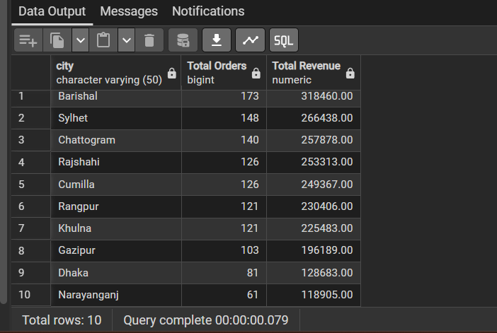

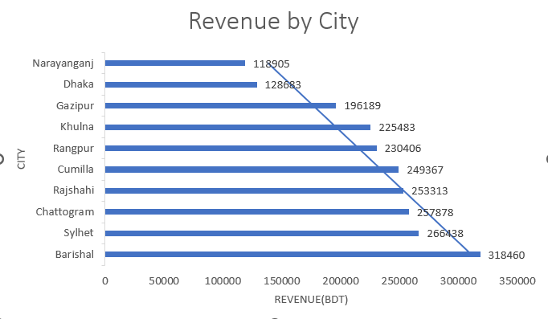

### Result Interpretation

The analysis identifies the cities contributing the highest number of orders and total revenue.

### Business Insight

Revenue generation is concentrated in a small number of high-performing cities, indicating stronger customer demand and purchasing activity in those locations.

### Recommendation

Increase marketing investment, promotional campaigns, and customer acquisition efforts in top-performing cities to maximize revenue growth.

---

## Q4. Monthly Order Trend

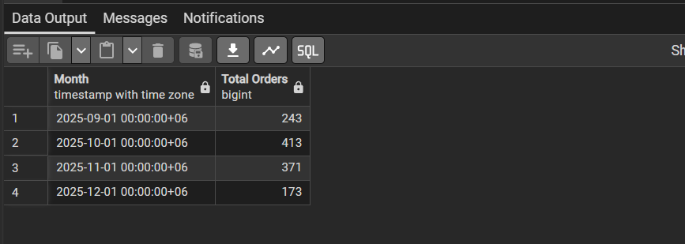

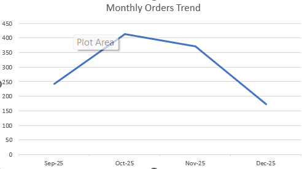

### Result Interpretation

Monthly order volume changes over time, highlighting fluctuations in customer purchasing activity.

### Business Insight

The trend helps identify periods of growth and slower demand, enabling better business planning and forecasting.

### Recommendation

Analyze peak sales periods and align marketing campaigns, inventory planning, and operational resources accordingly.

---

## Q5. Completed, Pending and Cancelled Order Rates

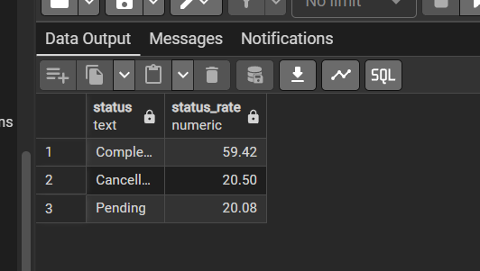

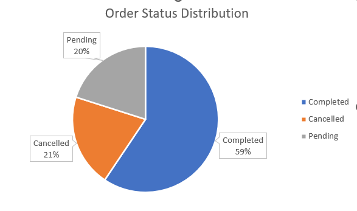

### Result Interpretation

Orders are categorized into Completed, Pending, and Cancelled statuses to evaluate operational performance.

### Business Insight

A higher completion rate indicates efficient order fulfillment, while elevated cancellation rates may signal operational or customer experience issues.

### Recommendation

Investigate cancellation causes and improve order processing efficiency to increase successful order completion rates.

---

## Q7. Product Category Revenue Analysis

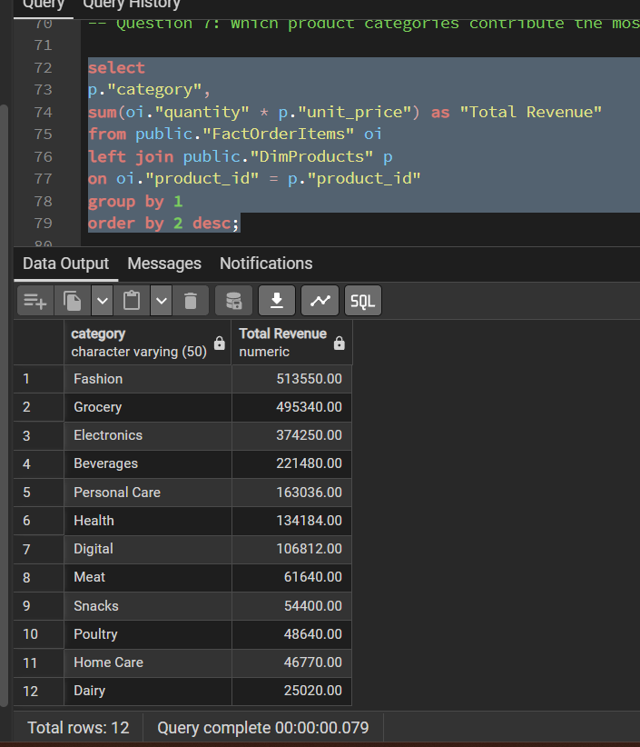

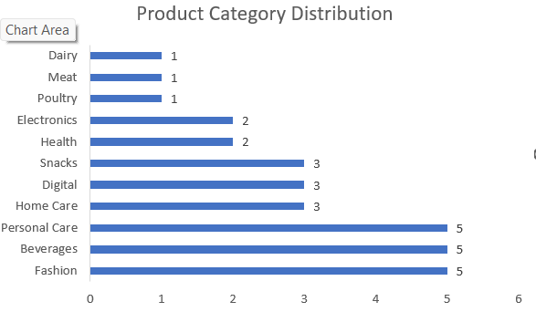

### Result Interpretation

Revenue contribution varies significantly across product categories.

### Business Insight

A limited number of categories contribute a substantial portion of total revenue, making them critical drivers of business performance.

### Recommendation

Prioritize inventory management, product promotion, and category-specific marketing efforts for top-performing categories.

---

## Q10. Stock-Out Risk Products

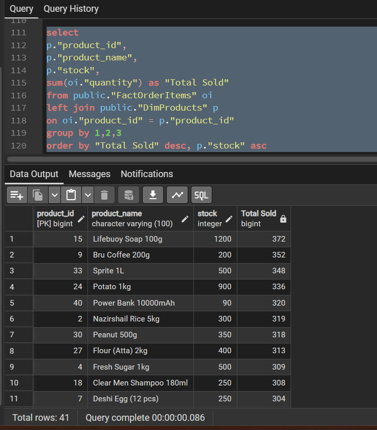

### Result Interpretation

Several products exhibit high sales volume while maintaining relatively low inventory levels.

### Business Insight

These products face a potential stock-out risk, which may result in missed sales opportunities and customer dissatisfaction.

### Recommendation

Implement proactive inventory replenishment strategies and closely monitor demand for high-performing products.

---

## Q17. Payment Method Analysis

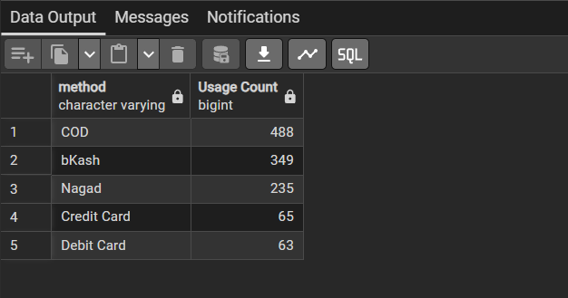

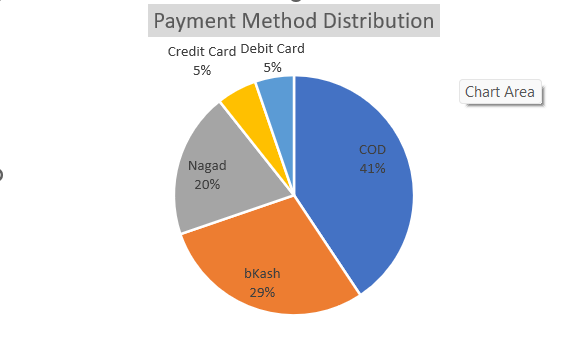

### Result Interpretation

The analysis identifies the most frequently used payment methods among customers.

### Business Insight

Cash on Delivery (COD) remains the dominant payment method, while digital payment methods continue to gain adoption.

### Recommendation

Encourage digital payment adoption through cashback offers, discounts, and promotional incentives.

---

## Q23. Product Affinity Analysis

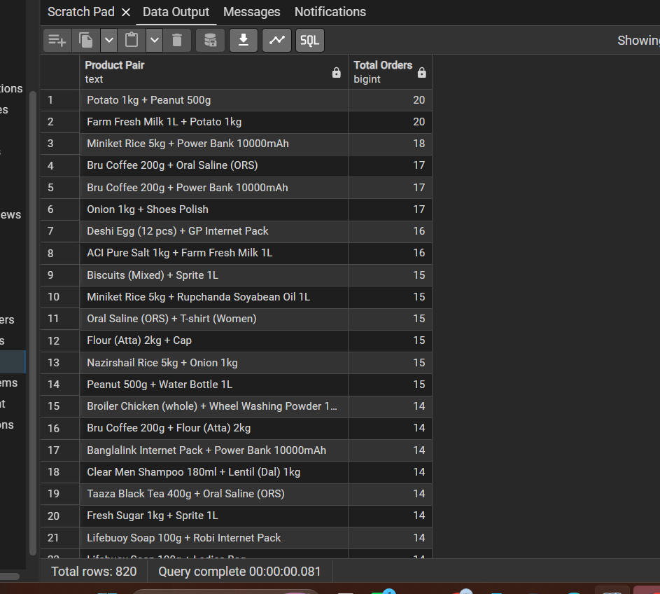

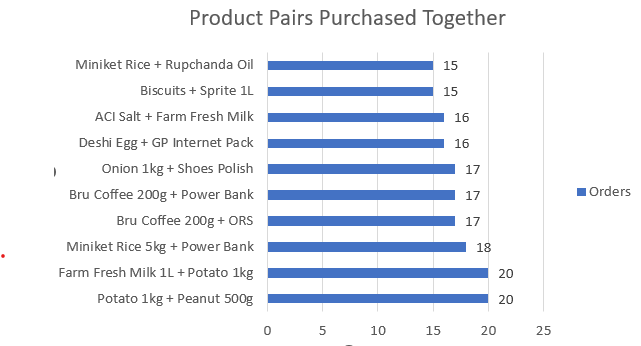

### Result Interpretation

Certain product combinations are frequently purchased together within the same order.

### Business Insight

These purchasing patterns reveal natural product associations and cross-selling opportunities.

### Recommendation

Create bundle offers, recommendation systems, and targeted promotions based on frequently purchased product pairs.

---

## Q25. Daily Business Performance Report

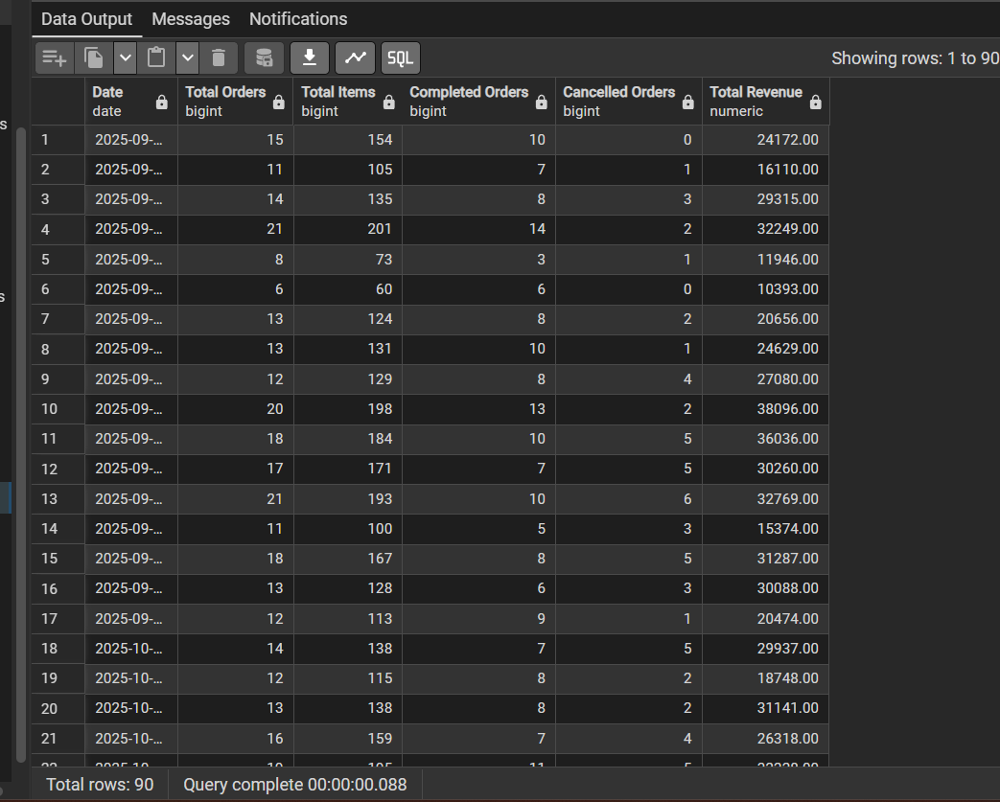

### Result Interpretation

The daily report summarizes total orders, completed orders, cancelled orders, total items sold, and daily revenue.

### Business Insight

Daily KPI monitoring provides management with a real-time view of operational and financial performance.

### Recommendation

Develop automated dashboards to continuously track key business metrics and support data-driven decision-making.


---

## Key Findings and Insights

### Sales Performance

* UrbanCart processed a total of 1,200 orders during the analysis period.
* Revenue generation is concentrated within a small number of high-performing cities.
* A limited number of products contribute a substantial portion of overall revenue.

### Customer Insights

* Gmail is the dominant email provider among customers.
* High-value customers contribute significantly to total revenue.
* Seasonal purchasing patterns reveal customer retention opportunities.

### Product Insights

* Revenue contribution varies considerably across product categories.
* Several products exhibit stock-out risk due to strong demand and low inventory.
* Product affinity analysis identified frequently purchased product combinations.

### Payment Insights

* Customer payment preferences vary across locations.
* Certain payment methods dominate transaction volume.
* Payment behavior influences order completion and cancellation trends.

---

## Technologies Used

* PostgreSQL
* SQL
* pgAdmin 4
* DrawSQL
* Microsoft Excel
* GitHub
* Markdown

---

## Repository Structure

```text
UrbanCart-Data-Analytics
│
├── README.md
├── ER_Diagram.webp
│
├── database/
│   ├── DimCustomers.csv
│   ├── DimProducts.csv
│   ├── FactOrders.csv
│   ├── FactOrderItems.csv
│   └── FactPayment.csv
│
├── sql_queries/
│   ├── Q01_Total_Orders.sql
│   ├── Q02_Cities_Orders_Revenue.sql
│   ├── Q03_Gmail_Customer_Percentage.sql
│   ├── Q04_Monthly_Order_Trend.sql
│   ├── Q05_Order_Status_Rate.sql
│   ├── Q06_Total_Revenue.sql
│   ├── Q07_Category_Revenue.sql
│   ├── Q08_Top_Revenue_Products.sql
│   ├── Q09_AOV_and_Basket_Size.sql
│   ├── Q10_Stockout_Risk_Products.sql
│   ├── Q11_Top_Customers_By_Revenue.sql
│   ├── Q12_Cancellation_Rate.sql
│   ├── Q13_Gender_Purchasing_Pattern.sql
│   ├── Q14_Customer_Behavior_Over_Time.sql
│   ├── Q15_October_Not_December.sql
│   ├── Q16_October_And_December.sql
│   ├── Q17_Payment_Method_Usage.sql
│   ├── Q18_Payment_Method_vs_Status.sql
│   ├── Q19_City_Payment_Preference.sql
│   ├── Q20_High_Value_Orders.sql
│   ├── Q21_Items_Per_Order_By_Payment.sql
│   ├── Q22_Product_vs_Category_Price.sql
│   ├── Q23_Frequent_Product_Pairs.sql
│   ├── Q24_Highest_Revenue_Product_Pairs.sql
│   └── Q25_Daily_Business_Report.sql
│
└── outputs/
    ├── payment_method_chart.png
    ├── product_category_chart.png
    │
    ├── Q1_result.png
    ├── Q2_result.png
    ├── Q3_result.png
    ├── Q4_result.png
    ├── Q5_result.png
    ├── Q6_result.png
    ├── Q7_result.png
    ├── Q8_result.png
    ├── Q9_result.png
    ├── Q10_result.png
    ├── Q11_result.png
    ├── Q12_result.png
    ├── Q13_result.png
    ├── Q14_result.png
    ├── Q15_result.png
    ├── Q16_result.png
    ├── Q17_result.png
    ├── Q18_result.png
    ├── Q19_result.png
    ├── Q20_result.png
    ├── Q21_result.png
    ├── Q22_result.png
    ├── Q23_result.png
    ├── Q24_result.png
    └── Q25_result.png

```

## Author

**Rubina Akter**

Aspiring Data Analyst with a focus on SQL, Data Analytics, and Business Intelligence.

This project demonstrates the application of PostgreSQL for solving real-world retail business problems through data-driven analysis.
